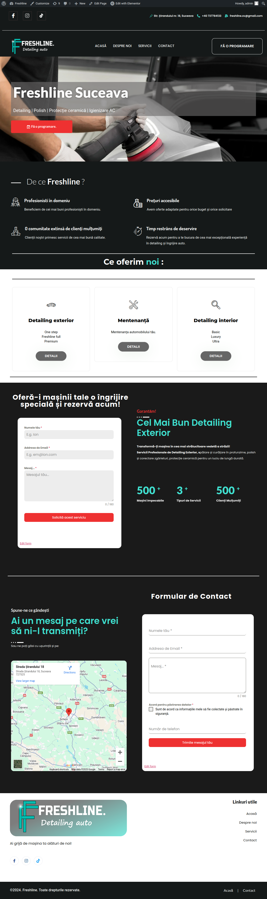
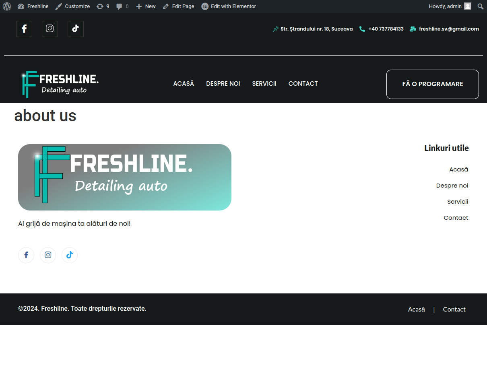
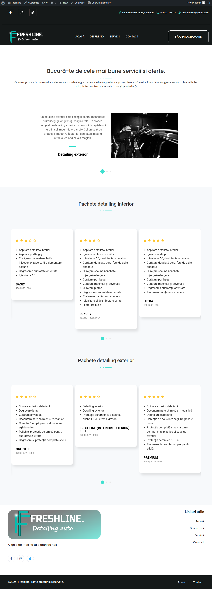

# FreshLine

FreshLine is a project aimed at providing fresh and clean code solutions for various programming challenges.

## Features

- Clean and readable code
- Efficient algorithms
- Comprehensive documentation

## Installation

To install FreshLine, clone the repository and navigate to the project directory:

```bash
git@github.com:vladik9/freshLine.git
cd freshLine
```

## Usage

Provide examples of how to use your project. For example:

```python
from freshline import some_function

result = some_function()
print(result)
```

## Contributing

We welcome contributions! Please read our [contributing guidelines](CONTRIBUTING.md) for more details.

## License

This project is licensed under the MIT License - see the [LICENSE](LICENSE) file for details.

## Contact

For any questions or feedback, please open an issue or contact us at [v.cornici@gmail.com](mailto:email@example.com).

## Images

Home page:



About us page:



Services page:



Contact page:


## Dump image sql

Import backup.sql

Create a:

```bash
'DB_NAME', 'wordpress'
```

```bash
'DB_USER' :  'wpuser'
```

```bash
'DB_PASSWORD' : 'password'
```

```bash
'DB_HOST' : 'localhost'
```

Visit [Link](https://ubuntu.com/tutorials/install-and-configure-wordpress "config") for more information!
update db to refelct new links

```bash
UPDATE wp_options SET option_value = 'http://192.168.0.52:8086/' WHERE option_name = 'siteurl';
UPDATE wp_options SET option_value = 'http://192.168.0.52:8086/' WHERE option_name = 'home';
```
